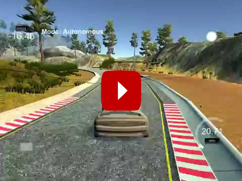

# PID Control on Simulator
Self-Driving Car Engineer Nanodegree Program

---
This project implements two PID controllers (steering and throttle) to drive a car in the Udacity simulator.

## How to run

The program expects 5 command line parameters (suggested values in brackets):

* Steer PID proportional coefficient [-0.2]
* Steer PID differential coefficient [-2]
* Throttle PID proportional coefficient [-0.05]
* Throttle PID differential coefficient [-10]
* Base throttle value [0.7, 1 for a faster drive].

## Result
Using the suggested parameters:

[A faster drive](https://youtu.be/M4MO74J3Vro "PID Controller Faster drive"), with base throttle=1

## Reflection

A PID controller needs a proportional, an integral and a differential coefficient, in this case:

* Proportional coefficients control how much to steer/decelerate when the car is off-center. 
* Integral coefficients would control systematic bias, such as a car that turns 5º right with the steering wheel in its center position. No need for this coefficient was detected, so it's value is hard-coded as 0, not contributing to the PID output. 
* Differential coefficients control how much to steer/decelerate when the car is moving away from the center.

Driving around a track, the proportional component of the steering PID would keep the car roughly at the center of the road in straight sections, while its differential component would apply steering when the car is moving away from the center, presumably when entering a curve. This means the car needs to actually move away from the center of the road for the controller to detect how fast is the motion, and try to correct the course.

If the proportional coefficient is too high, it induces overcompensation that results in the car swerving from side to side, as can be seen in [this video](https://youtu.be/YFO_mcCtUhg "PID Controller Swerving"). If too low, the car would slowly go off track, as the differential component would not act for slow deviations. 

The throttle PID would act similarly, applying less throttle when the car goes away from the center, or even braking when it's in a corner.

The values for all of the coefficients were manually adjusted until the result was considered acceptable.

---

This project was completed for the Udacity Self Driving Car Nanodegree 

